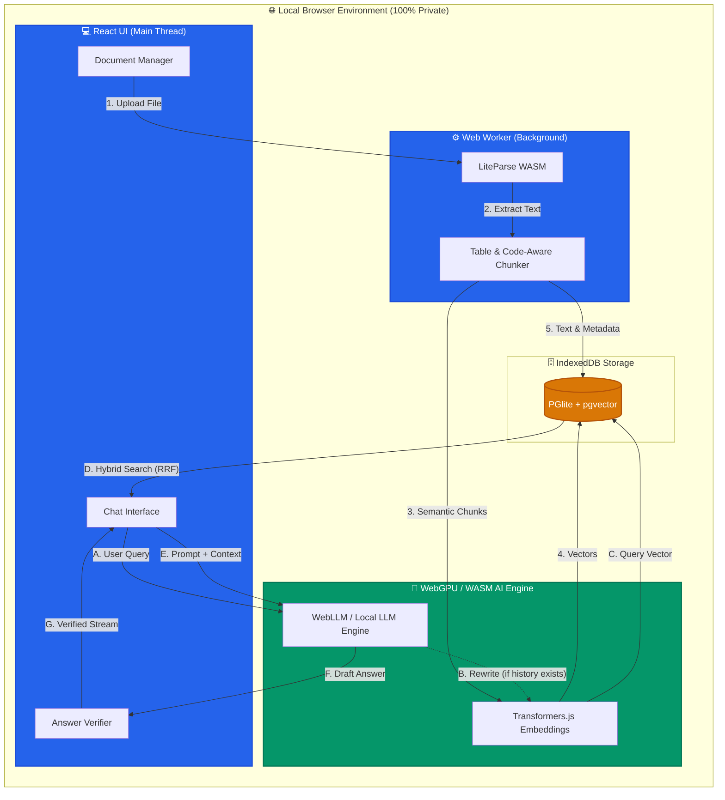
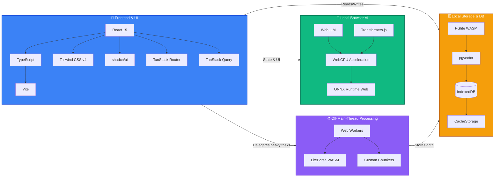

# Gyaanसूत्र (Gyaansutra)

A fully local, private Retrieval-Augmented Generation (RAG) system running entirely within your web browser. This application keeps all document parsing, text chunking, embedding generation, vector database search, and large language model (LLM) inference strictly on the client side. No data leaves your machine.

## 🚀 Architecture & Workflow

Gyaanसूत्र brings a complete backend RAG pipeline into the browser using WebAssembly and WebGPU. 



### Data Ingestion Workflow
1. **Document Parsing**: Files (`.pdf`, `.md`, `.txt`, `.html`, `.csv`, `.json`) are processed natively in the browser. PDFs are parsed locally via `@llamaindex/liteparse-wasm` without external remote servers.
2. **Intelligent Chunking**: The text is split into semantic chunks (with special Code-Aware handling to prevent code blocks from being shredded inappropriately). This runs in an off-main-thread Web Worker to keep the UI smooth.
3. **Embedding Generation**: Chunks are embedded locally using `Transformers.js` powered by WebGPU (or WASM multi-threading fallback).
4. **Vector Storage**: The embeddings and metadata are stored in `PGlite` (a WASM build of PostgreSQL) using the `pgvector` extension. The database persists locally via `IndexedDB`.

### Generation (RAG) Workflow
1. **Query Rewriting**: Multi-turn chat history is passed to a fast local LLM (or heuristics) to rewrite follow-up questions into standalone search queries.
2. **Hybrid Search**: `PGlite` performs a semantic vector search (cosine similarity via `pgvector`) combined with keyword full-text search (ranked by `ts_rank`).
3. **Reciprocal Rank Fusion (RRF)**: The results from semantic and keyword searches are mathematically merged and re-ranked to surface the most relevant context.
4. **LLM Synthesis**: A local LLM engine (e.g. WebLLM, Transformers.js) streams the answer based *only* on the retrieved context. 
5. **Strict Verification**: The output is parsed and verified sentence-by-sentence. Any claims or sentences that cannot be grounded in the provided citations are mathematically dropped to prevent hallucinations.

## 🛠️ Detailed Tech Stack & Rationale



### 1. Frontend & Tooling
*   **React 19 & TypeScript:** React provides a declarative approach to building the reactive user interface. TypeScript enforces strict type safety across the entire codebase, heavily reducing runtime errors and improving developer experience.
*   **Vite:** Chosen as our bundler and dev server because it provides lightning-fast Hot Module Replacement (HMR) and highly optimized production builds compared to traditional webpack.
*   **Tailwind CSS v4 & shadcn/ui:** Tailwind allows for rapid utility-first styling without ever leaving the component file. `shadcn/ui` provides accessible, highly customizable, and unstyled base components (via radix-ui) that we can easily style with Tailwind.
*   **TanStack Router & Query:** The Router provides 100% type-safe routing across the SPA, while Query handles asynchronous state management, caching, and background syncing for our local database queries seamlessly.

### 2. Local AI & Machine Learning
*   **WebLLM:** This is the core of our local intelligence. WebLLM allows us to run large language models (like Qwen, Llama, Gemma) entirely in the browser using WebGPU. **Why?** It avoids server roundtrips, ensures 100% privacy, and leverages the user's local GPU hardware for generation.
*   **Transformers.js:** Used for local embedding generation. It utilizes the ONNX Runtime Web to run transformer models efficiently in the browser, allowing us to convert text chunks into vector embeddings for semantic search completely offline.
*   **WebGPU & WASM:** These low-level browser APIs are critical enablers. WebGPU provides the parallel processing power required for LLM inference, while WebAssembly (WASM) allows us to run heavy C/C++/Rust logic at near-native speeds in JavaScript.

### 3. Local Database & Persistence
*   **PGlite (PostgreSQL in WASM):** A WASM build of PostgreSQL running directly in the browser. **Why?** Standard IndexedDB is too basic for RAG. We need complex querying (like JOINs and full-text search), which a real relational database handles perfectly.
*   **pgvector:** A crucial extension for PostgreSQL that allows us to store vector embeddings and perform exact nearest-neighbor search (cosine similarity). This is the engine powering our semantic search.
*   **IndexedDB & CacheStorage:** PGlite persists its underlying database files to IndexedDB so data survives page reloads. CacheStorage is heavily used by the AI engines to permanently store multi-gigabyte model weights so they are only downloaded once.

### 4. Processing & Extraction
*   **Web Workers:** Heavy CPU tasks like document parsing, chunking, and embedding generation are strictly pushed to background Web Workers. **Why?** This ensures the main UI thread never blocks, keeping the app smooth and responsive even during massive document ingestions.
*   **LiteParse WASM:** Used to extract text and accurately format markdown tables from PDFs. It runs entirely offline, avoiding the privacy risks and latency of sending private documents to a remote OCR server.

## 🌟 Key Features

- **100% Offline & Private**: A Progressive Web App (PWA) with Service Worker caching that runs entirely locally after the initial load.
- **Multi-Project Workspaces**: Isolated environments with dedicated, locked embedding models to ensure vector space consistency.
- **TrustScore Verification**: Built-in `/eval` evaluation dashboard to benchmark refusal accuracy, hallucination drop rates, and parse failures.
- **Traceable Citations**: Generated responses include interactive citation tooltips linking back to source document chunks.
- **Debug UI**: Inspect the retrieval and generation pipeline step-by-step. View the rewritten query, semantic/keyword hits, RRF scores, truncation warnings, and precise timings directly in the chat UI.
- **Database Backup & Restore**: Export and import the entire local workspace (projects, documents, vectors, history) via `.tar.gz` compressed tarballs.

## 🏁 Getting Started

### Prerequisites
- Node.js (v18+)
- `pnpm` package manager (do not use npm/yarn)

### Installation

1. Clone the repository and install dependencies:
```bash
pnpm install --frozen-lockfile
```

2. Start the development server:
```bash
pnpm dev
```

3. Build for production:
```bash
pnpm build
pnpm preview
```

## 📝 License
This project is open-source. Please check the repository for license details.
